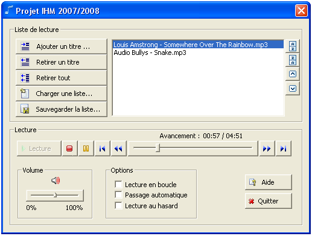
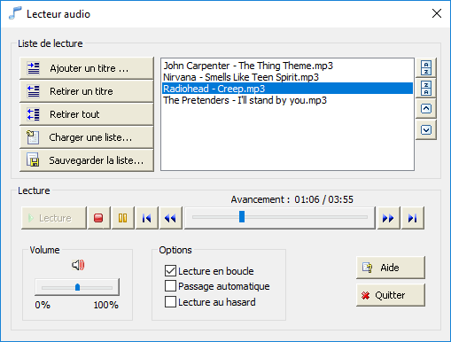
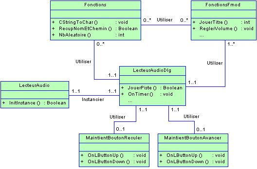

# Audio player

Windows **MFC** application for playing **MP3 audio files**.

---

# Table of Contents

* [About the project](#about-the-project)
* [Usage](#usage)
* [Technical details](#technical-details)
    * [FMod Ex library](#fmod-ex-library)
    * [Program](#program)
        * [UML class diagram](#uml-class-diagram)
        * [Generated classes](#generated-classes)
        * [Created classes](#created-classes)
* [License](#license)

# About the project

The purpose of this project was to create a **Windows MFC** (**M**icrosoft **F**oundation **C**lass library) application for playing **MP3 audio files**.

The goal is to develop an audio player with a classic graphical interface, including a play, pause/stop button, volume control, skip to next/previous track,
and a playlist with the ability to add, delete and reorganize tracks, as well as saving and loading a playlist.

This program was part of a school project and was created in **December 2007**.

It was originally created with **Microsoft Visual Studio 2005**.

# Usage

Just run the _LecteurAudio.exe_ file from the _Release_ directory, then play with the UI :

> [!IMPORTANT]
> You must have the **FMod Ex** library (_fmodex.dll_) in the same folder.

It may look a little strange on newer operating systems as I used some images to represent the buttons :sweat_smile: but it should still work fine :

# Technical details

## FMod Ex library

The **FMOD** library basically allows to read and manage audio files, it is a cross-platform sound management library available for many languages.
It is free for personal use.

The **FMOD Ex** version of the library has been used (_FMOD 3 Programmers API Version 3.75_), which makes very easy to write audio applications for most of the .NET platform
languages, namely C, C ++, C #, Delphi and Visual Basic.

FMOD (v3.75) supports no less than 22 music formats:

- AIFF : Audio Interchange File Format
- ASF : Advanced Streaming Format, includes support for audio tracks in video streams
- ASX : Playlist format exploitable thanks to the FMOD Ex tag API
- DLS : DownLoadable Sound format for MIDI Sounds
- FLAC : Lossless compression codec
- FSB : FMOD Sample Bank format generated with FSBank and FMOD designer tools
- IT : Sequential format Impulse tracker. Does not require the presence of DirectX to be played.
- M3U : Playlist format exploitable thanks to the FMOD Ex tag API
- MID : MIDI format using the operating system or DLS patches
- MOD : Sequential format Protracker / Fasttracker and other sequential formats
- MP2 : MPEG I / II Layer 2
- MP3 : MPEG I / II Layer 3, with VBR support
- OGG : Format Ogg Vorbis
- PLS : Playlist format exploitable thanks to the FMOD Ex tag API
- RAW : Raw Format. The user can specify the number of channels, format etc.
- S3M : ScreamTracker Sequential Format 3
- VAG : Format specific to PS2 / PSP
- WAV : Microsoft Wave files, including compressed Wave files.
- WAX : Playlist format exploitable thanks to the FMOD Ex tag API
- WMA : Windows Media Audio Format
- XM : FastTracker 2 Sequential Format
- XMA : Format specific to Xbox 360

FMOD Ex is available for download from the official FMOD website at the following address: http://www.fmod.org

## Program

### UML class diagram

### Generated classes

The application is named "LecteurAudio", the following classes have been generated when creating the Visual Studio project :

- _LecteurAudio.h_ / _LecteurAudio.cpp_
- _LecteurAudioDlg.h_ / _LecteurAudioDlg.cpp_
- _Ressources.h_
- _stdafx.h_ / _stdafx.cpp_

The program is a dialog-based **MFC** application, using the FMOD Ex library.

`LecteurAudio` is the "main" class which initializes the application using the `InitInstance()` method.
Actually, the `Initinstance()` function of the application class sets up the dialog box and assigns the window address to the mainframe pointer (`m_pMainWnd`).
The `AfxGetMainWnd()` function will then return the address of the dialog box.

`LecteurAudioDlg` is the class generated for the dialog box, and is used to implement all dialog box functions.
The project generator automatically implements the code required to read the application's menu and manage the application's minimization.
These features can be found in the dialog box's `OnInitDialog()` and `OnPaint()` functions respectively.

`Resources.h` is simply a file used to define the resources required by the dialog box (images, icons, buttons, etc.).
An ID is defined for each object and an integer associated with this constant.

`Stdafx` is a source file for including standard system include files or project-specific include files that are frequently used and rarely modified.
This makes it possible to generate pre-compiled header files, thus reducing program compilation time.

There are also HTML help files (`AudioPlayer.hhc`, `AudioPlayer.hhk` and `AudioPlayer.hhp`).

### Created classes

The following classes have been created to handle some specific functionalities :

- _FunctionsFmod.h_ / _FunctionsFmod.cpp_
- _Functions.h_ / _Functions.cpp_
- _HoldButtonAvancer.h_ / _HoldButtonAvancer.cpp_
- _HoldReculerButton.h_ / _HoldReculerButton.cpp_

`FunctionsFmod` is a class in which we've defined all our functions using the FMOD Ex API functions.

`Functions` is a class in which we have defined all our general functions, such as random number generation or type conversion.

`MaintientBoutonAvancer` is a class that allows us to intercept the message sent when the user presses the left mouse button (`ON_WM_LBUTTONDOWN`)
without necessarily releasing (different from `ON_BN_CLICKED`) on a `CbitmapButton`. It is used for the "Fast Forward" button.

`MaintientBoutonReculer` is a class that allows us to intercept the message sent when the user presses the left mouse button (`ON_WM_LBUTTONDOWN`)
without necessarily releasing (different from `ON_BN_CLICKED`) on a `CbitmapButton`. It is used for the "Fast rewind" button.

# License

[General Public License (GPL) v3](https://www.gnu.org/licenses/gpl-3.0.en.html)

This program is free software: you can redistribute it and/or modify it under the terms of the GNU
General Public License as published by the Free Software Foundation, either version 3 of the
License, or (at your option) any later version.

This program is distributed in the hope that it will be useful, but WITHOUT ANY WARRANTY; without
even the implied warranty of MERCHANTABILITY or FITNESS FOR A PARTICULAR PURPOSE. See the GNU
General Public License for more details.

You should have received a copy of the GNU General Public License along with this program. If not,
see <http://www.gnu.org/licenses/>.